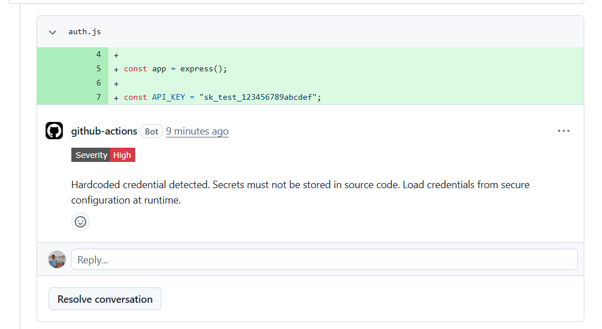

# Review Owl

A GitHub Action that reviews Pull Requests for **security issues** and **vulnerabilities**. This GitHub Action runs on every pull request in your project and automatically flags potential security problems and posts findings directly on PRs. It is easily configurable for your project using a simple `prowl.yml` file.



---

## Table of Contents

1. [Features](#features)
2. [How It Works](#how-it-works)
3. [Setup & Usage](#setup--usage)
   - [GitHub Actions Workflow](#1-github-actions-workflow)
   - [Inputs & Secrets](#2-inputs--secrets)
4. [Configuration (`prowl.yml`)](#configuration-prowlyml)
5. [Local Development & Contribution](#local-development--contribution)
   - [Prerequisites](#prerequisites)
   - [Available Scripts](#available-scripts)
   - [Code Quality & Linting](#code-quality--linting)
   - [Building for Release](#building-for-release)

---

## Features

- **Three-Stage Analysis**:
  1. **Dependency Scanning**: Checks changed dependencies against the [OSV database](https://osv.dev/) for known vulnerabilities.
  2. **Static Regex Scan**: Detects exposed secrets, keys, and unsafe function usage.
  3. **LLM-based Review**: Uses LLM model to review full diff context, validate findings, and detect deeper issues.
- **Inline PR Comments**: Adds findings directly to relevant lines in the pull request.
- **Noise Reduction**: Skips lockfiles, binaries, and generated assets to reduce irrelevant results.
- **Configurable Behavior**: You can easily adjust this tool for your project using `prowl.yml`, like choosing which files to scan, which ones to ignore, adding your own security rules, and selecting the LLM model.

---

## How It Works


1. **Trigger & Fetch**: Runs on `pull_request` events and fetches the raw git diff from the GitHub API using `@actions/github` and `@octokit/rest`.
2. **Parsing & Filtering ([parse.ts](src/features/pr/git-diff/parse.ts))**: The diff is structured using `parse-diff`. It ignores common system/binary extensions (like images, PDFs, maps) and lockfiles (`package-lock.json`, `pnpm-lock.yaml`, `bun.lockb`, etc.).
3. **Dependency Scanning ([check-vulnerabilities.ts](src/features/pr/cve-detection/check-vulnerabilities.ts))**: Extracts changed packages from dependency files and queries **Open Source Vulnerabilities (OSV)** for known issues.
4. **Static Analysis ([engine.ts](src/features/pr/security-engine/engine.ts))**: Runs regex checks for secrets, API keys, and unsafe patterns like `eval()`.
5. **LLM Review ([review.ts](src/features/pr/llm-call/review.ts))**: Sends diff data, CVEs, and static findings to the model for validation and deeper analysis.
6. **Commenting ([octokit](src/features/pr/octokit))**: Groups results and posts them as PR comments via Octokit.

---

## Setup & Usage

### 1. GitHub Actions Workflow

Create a file named `.github/workflows/security-review.yml` in your repository:

```yaml
name: AI Security Review

on:
  pull_request:
    types: [opened, synchronize]

jobs:
  review:
    name: Run Security Review
    runs-on: ubuntu-latest
    permissions:
      contents: read
      pull-requests: write # Required to post comments on the PR

    steps:
      - name: Checkout Code
        uses: actions/checkout@v4

      - name: Run Security Review
        uses: Org/Repo@tag
        with:
          github-token: ${{ secrets.GITHUB_TOKEN }}
          openai-api-key: ${{ secrets.OPENAI_API_KEY }}
```

### 2. Inputs & Secrets

| Input            | Description                                                | Required | Default / Note                        |
| :--------------- | :--------------------------------------------------------- | :------: | :------------------------------------ |
| `github-token`   | GitHub token used to fetch the PR diff and write comments. | **Yes**  | Usually `${{ secrets.GITHUB_TOKEN }}` |
| `openai-api-key` | API key for LLM-based analysis                             | **Yes**  | Save in repository **Secrets**        |

---

## Configuration (`prowl.yml`)

You can control behavior using a prowl.yml file:

```yaml
# Specify the LLM Model
model: "gpt-5-mini"

# Explicitly exclude files or directories using glob patterns
ignore:
  - "**/tests/**"
  - "docs/**"
  - "*.test.js"

# Explicitly specify files to scan (takes precedence if defined)
filesToScan:
  - "src/**/*.ts"
  - "lib/**/*.js"

# Define custom regex rules for the static scanning engine
rules:
  - id: "slack-webhook"
    description: "Slack webhook URL detected. Avoid committing tokens."
    pattern: "https://hooks\\.slack\\.com/services/T[A-Z0-9_]+/B[A-Z0-9_]+/[A-Za-z0-9_]+"
    severity: "high"
    fileExtensions:
      - ".ts"
      - ".js"
      - ".json"
```

### Configuration Options Reference

- **`model`**: LLM model used for review.
- **`ignore`**: Appended to the default ignored file patterns.
- **`filesToScan`**: If defined, only files matching these globs will be reviewed.
- **`rules`**: Custom regex rules. Each rule requires:
  - `id`: A unique string identifier.
  - `description`: The feedback message posted to the PR if triggered.
  - `pattern`: A RegExp string pattern to match.
  - `severity`: `"high"`, `"medium"`, or `"low"`.
  - `fileExtensions` (optional): Limits the rule to specific extensions.

---

## Local Development & Contribution

We welcome contributions! Please follow the steps below to set up your local development environment.

### Prerequisites

Uses [Bun](https://bun.sh/).

1. Install Bun:
   ```bash
   curl -fsSL https://bun.sh/install | bash  # macOS/Linux
   # For Windows, check: https://bun.sh/docs/installation
   ```
2. Clone and install:
   ```bash
   git clone <Repo_URL>
   cd <Repo_Name>
   bun install
   ```

### Available Scripts

- **Development Mode**:
  ```bash
  bun run dev
  ```
- **Run Once**:
  ```bash
  bun run start
  ```
- **Lint Code**:
  ```bash
  bun run lint
  ```
- **Format & Fix**:
  ```bash
  bun run fix
  ```

### Code Quality & Linting

Uses ESLint and Prettier. Run `bun run fix` before committing. Checks run via `husky` and `lint-staged`.

### Build for Release

Before submitting a Pull Request, ensure that the compiled distribution code is up to date:

```bash
bun run build
```

This compiles `src/index.ts` to `dist/index.js` targeting Node.js, which is the entry point used by the GitHub Action environment. Ensure the changes to `dist/` are staged and committed.
